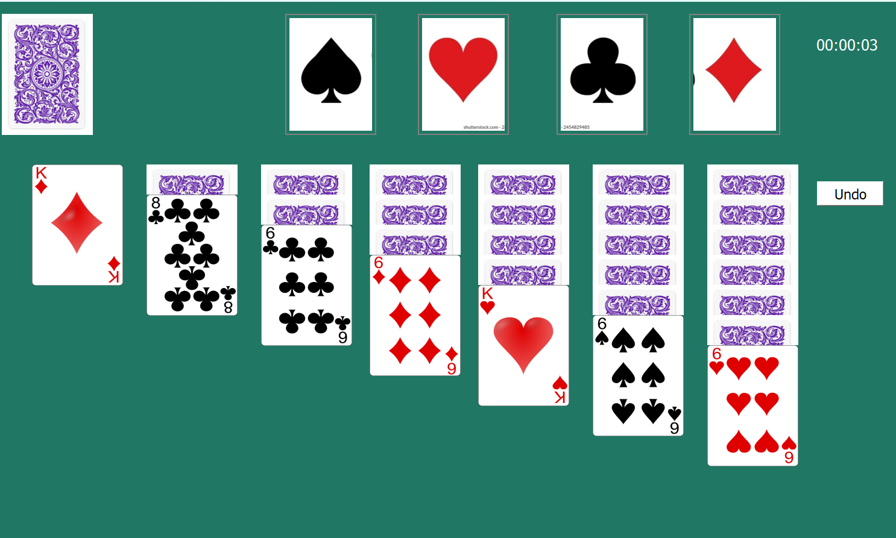

# PyQt Solitaire Game

This is a solitaire game built with PyQt5 for the graphical user interface. The game includes classic solitaire features such as tableau columns, stockpile, waste pile, and foundation piles. It follows the rules of standard solitaire, where cards can be moved based on alternating colors and descending order. These features are implemented with data structures such as stacks, queues etc.


## Installation

Install this game:

```bash
git clone https://github.com/Mustafa-Noor/Klondike-Solitaire
```
```bash
pip install pyqt5
```
    
## How To Run
Go to the address where folder clone is then on terminal:
```bash
python solitaire.py
```

## 📏 Game Rules

- Build 4 foundation piles by suit (Ace → King)
- Arrange cards in tableau columns in descending/alternate colors
- Draw cards from stockpile into the waste pile
- Move cards following standard Solitaire rules
- Win condition: all cards in foundation piles

## 📚 Data Structures Used

| Structure      | Application                                      |
|----------------|--------------------------------------------------|
| Stack (LIFO)   | Foundation piles, tableau column behavior        |
| Queue (FIFO)   | Stockpile / draw pile                            |
| Linked List    | Dynamic tableau column manipulation              |
| Array/List     | Deck shuffling and initialization                |
| Dictionary     | Card state tracking (face-up/down, pile info)    |


## 🖼️ Screenshots


### Game Layout



## Dependencies
- Python 3.7+

- PyQt5: For the graphical user interface.
